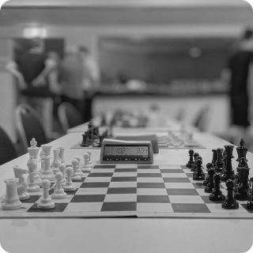

<h1 align="center"></h1>

# Проект лендинга для шахматного клуба

*Проект сверстан с помощью технологии flex.Лендинг шахмотного клуба с формой в открывающемся попапе.Страница адаптивна под все виды устройсв и гаджетов*

## Технологии, использованные при создании:

- Flexbox
- Методология BEM
- Файловая структура BEM Nested
- Адаптивная верстка (мобильные устройства, планшеты, десктопы)
- Препроцессоры SCSS

## Языки:

- HTML
- CSS
- JavaScript

[МАКЕТ В FIGMA](https://www.figma.com/file/G3UWFlQmNtNs67751YiDH2/Month-of-Landings?node-id=2%3A637)

[ссылка на сайт](https://george051191.github.io/shahmati/index.html)

# ***Проект сделан в рамках учебного курса "Веб-разработчик+" Яндекс.Практикума***
